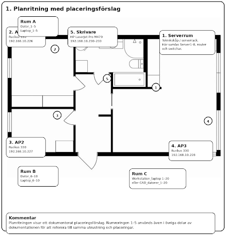
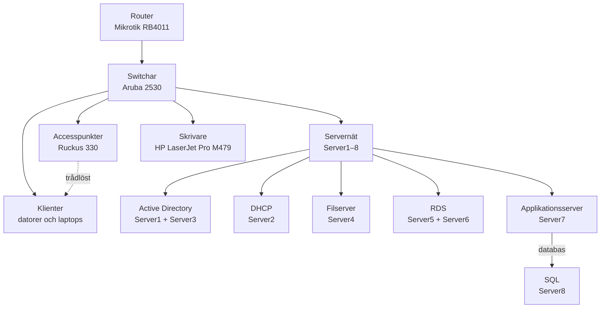
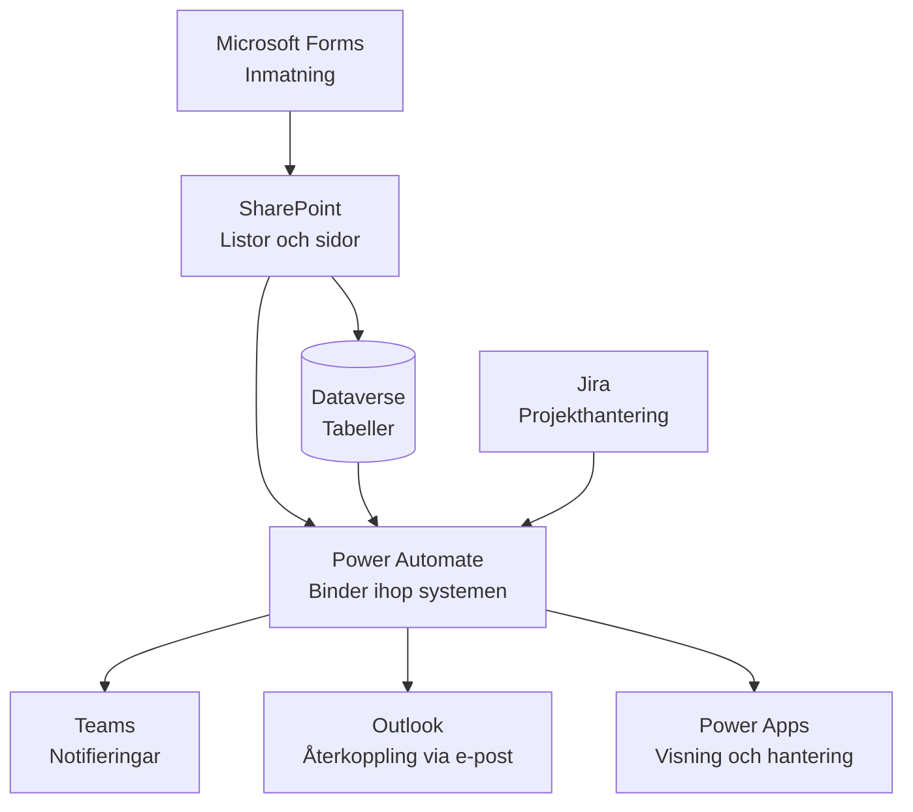
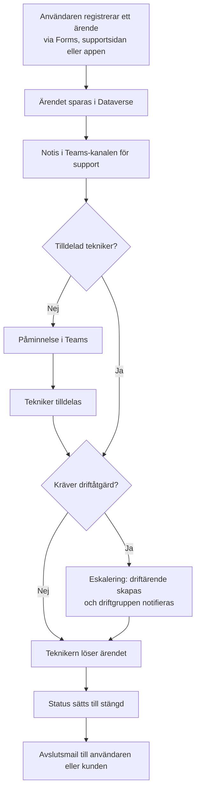
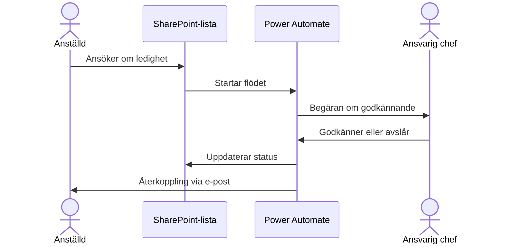
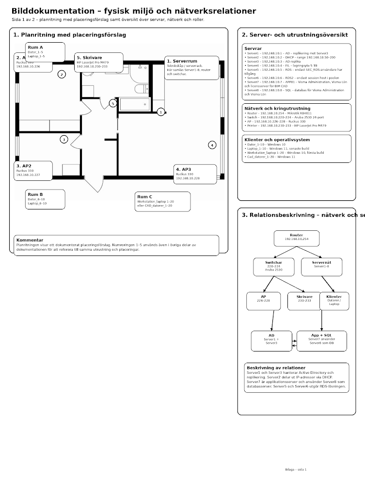
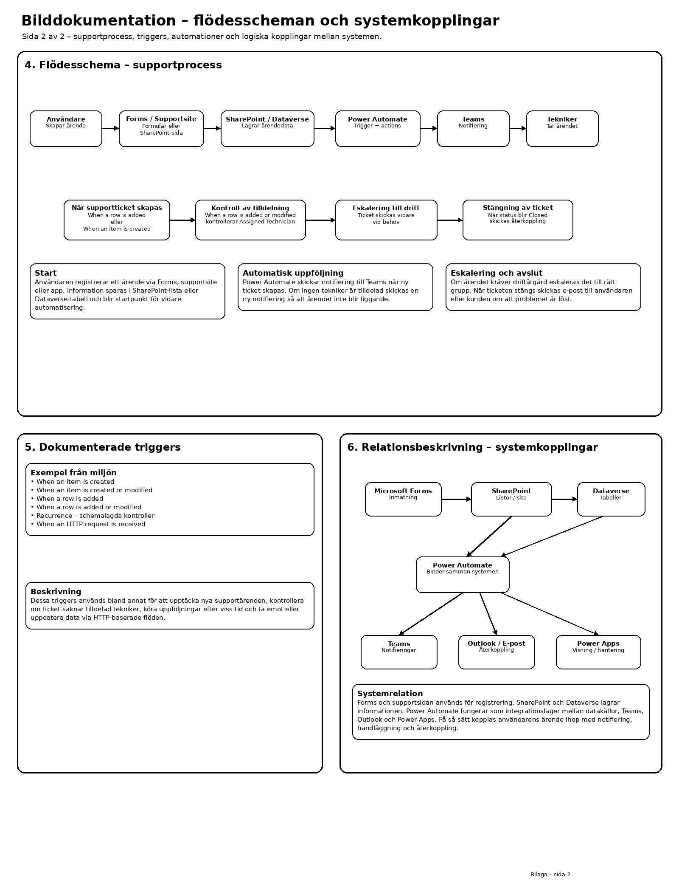

# Supportsystem i Microsoft 365 – IT-miljö, ärendehantering och automatisering

En supportmiljö i Microsoft 365 där ärenden registreras, fördelas, eskaleras och avslutas med automatiska flöden i Power Automate. Miljön innehåller också en frånvarokalender med godkännandeflöde, ett enhetsregister med övervakning och en integration med Jira. Uppgiften omfattar även dokumentation av den fysiska IT-miljön: placering av utrustning, servrar, nätverk och klienter.

> Skoluppgift inom utbildningen Moln- och virtualiseringsspecialist, Campus Mölndal. Miljön delades med andra projektgrupper i klassen.

**Teknik:** Microsoft 365 · SharePoint Online · Microsoft Teams · Exchange Online · Power Automate · Power Apps · Dataverse · Microsoft Forms · Jira

---

## Fysisk miljö och nätverk



*Planritning med placeringsförslag. Numreringen 1–5 används i resten av dokumentationen.*

| Nr | Plats | Utrustning |
|---|---|---|
| 1 | Serverrum | Teknikskåp med Server1–8, router och switchar |
| 2 | AP1 | Accesspunkt Ruckus 330 |
| 3 | AP2 | Accesspunkt Ruckus 330 |
| 4 | AP3 | Accesspunkt Ruckus 330 |
| 5 | Skrivare | HP LaserJet Pro M479 |

| Rum | Klienter |
|---|---|
| Rum A | Dator 1–5 och Laptop 1–5 |
| Rum B | Dator 6–10 och Laptop 6–10 |
| Rum C | Workstation-laptop 1–20 eller CAD-dator 1–20 |

### Servrar

| Server | IP-adress | Roll |
|---|---|---|
| Server1 | 192.168.10.1 | Active Directory, replikering mot Server3 |
| Server2 | 192.168.10.2 | DHCP, delar ut 192.168.10.50–200 |
| Server3 | 192.168.10.3 | AD-replika |
| Server4 | 192.168.10.4 | Filserver med 5 TB lagring |
| Server5 | 192.168.10.5 | RDS, bara användare i gruppen SEC_RDS har åtkomst |
| Server6 | 192.168.10.6 | RDS2, endast session host i poolen |
| Server7 | 192.168.10.7 | APP01: Visma Administration, Visma Lön och licensserver för BIM/CAD |
| Server8 | 192.168.10.8 | SQL-databas för Visma Administration och Visma Lön |

### Nätverk och kringutrustning

| Enhet | IP-adress | Modell |
|---|---|---|
| Router | 192.168.10.254 | Mikrotik RB4011 |
| Switchar | 192.168.10.220–224 | Aruba 2530, 24 portar |
| Accesspunkter | 192.168.10.226–228 | Ruckus 330 |
| Skrivare | 192.168.10.230–233 | HP LaserJet Pro M479 |

### Klienter

| Klienter | Operativsystem |
|---|---|
| Dator 1–10 | Windows 10 |
| Laptop 1–10 | Windows 11, senaste build |
| Workstation-laptop 1–20 | Windows 10, första build |
| CAD-dator 1–20 | Windows 11 |

### Relationer



Server1 och Server3 hanterar Active Directory och replikerar mellan sig, och Server2 delar ut IP-adresser via DHCP. Server5 och Server6 utgör tillsammans RDS-lösningen, och Server7 är applikationsserver för Visma med Server8 som databasserver.

## Microsoft 365 – systemöversikt



Forms och supportsidan används för att registrera ärenden. SharePoint och Dataverse lagrar informationen, och Power Automate fungerar som integrationslager mellan datakällorna, Teams, Outlook och Power Apps.

| Tjänst | Användning |
|---|---|
| Exchange Online | E-post och kalender |
| SharePoint Online | Dokumenthantering, intranät, supportsida och listor för flöden |
| OneDrive | Personlig lagring |
| Microsoft Teams | Kommunikation, samarbete och notifieringar |
| Power Automate | Arbetsflöden och automatisering |
| Power Apps | Interna appar för support och enheter |
| Dataverse | Datalager för appar och flöden |

## Supportprocessen



## Frånvarokalender

Anställda ansöker om ledighet i en SharePoint-lista, och resten sköts automatiskt:



Ansökningarna hanteras utan manuellt arbete, och varje beslut dokumenteras i listan.

## Power Automate-flöden

Flöden namnges enligt standarden `[Område]-[Beskrivning]-[Version]`, till exempel `Support-NotifyNewTicket-v1`. Miljön har 16 aktiva flöden.

### Ärendehantering

| Flöde | Trigger | Resultat |
|---|---|---|
| Notis vid nytt ärende | Ny rad i tabellen Support Ticket | Supportgruppen får notis i Teams direkt |
| Kontroll av tilldelad tekniker | Rad skapas eller ändras i Support Ticket | Ärenden utan ansvarig tekniker uppmärksammas i Teams |
| Eskalering till drift | Ärendet klassas som driftrelaterat | Driftärende skapas, driftgruppen notifieras och ursprungsärendet får eskaleringsstatus |
| Kontroll av tekniker för driftärenden | Rad skapas eller ändras i driftärenden | Driftärenden blir inte liggande utan ansvarig |
| Avslutsmail | Status ändras till stängd | Användaren eller kunden informeras automatiskt |
| Räkna aktiva ärenden | Schema | Antalet öppna ärenden följs upp i Teams eller en lista |

### Frånvaro

| Flöde | Trigger | Resultat |
|---|---|---|
| Ledighetsansökan med godkännande | Ny ansökan i SharePoint-listan | Godkännande från ansvarig, statusuppdatering och återkoppling via e-post |

### Enhetsregister och övervakning

| Flöde | Trigger | Resultat |
|---|---|---|
| Lägg till dator i listan | Power Apps eller formulär | Validerar fälten, kontrollerar dubbletter via serienummer eller enhets-ID och skapar en ny rad |
| Ledigt diskutrymme under 30 % | Objekt skapas eller ändras | Varningsstatus eller notis innan utrymmet blir kritiskt |
| Ledigt diskutrymme över 20 % | Objekt skapas eller ändras | Enheten markeras som normal eller lämnar varningsstatus |
| Dator inte uppdaterad på 3 dagar | Schema, var 24:e timme | Notis i Teams eller via e-post |

### Integrationer och övrigt

| Flöde | Trigger | Resultat |
|---|---|---|
| HTTP – skriv | HTTP-anrop med JSON | Skapar en rad i SharePoint eller Dataverse och returnerar en svarskod |
| HTTP – uppdatera | HTTP-anrop med JSON | Uppdaterar ett befintligt objekt och returnerar status |
| Hämta Jira-ärenden | Schema, varje timme | Aktiva Jira-ärenden publiceras som numrerad lista i Teams |
| E-post vid nytt objekt | Nytt objekt i en SharePoint-lista | Automatiskt e-postmeddelande |
| Hämta ändringar | Objekt skapas eller ändras i SharePoint | Identifierar vilka fält som ändrats, för vidare uppföljning |

Jira-flödet söker fram aktiva ärenden med JQL:

```sql
project = SCRUM AND status != Done ORDER BY created ASC
```

### Inaktiva flöden
Tre flöden är dokumenterade men avstängda: en äldre version av kontrollen av datorlistan, en varning när diskutrymmet understiger 20 % och en uppföljning av ärenden som är äldre än 10 dagar.

### Ibland behövs inget flöde
Antalet aktiva ärenden kan också visas direkt i SharePoint, genom att redigera listans vy och slå på **Totals** med **Count** på en kolumn som alltid har ett värde.

## SharePoint

| Webbplats | Användning |
|---|---|
| Intranät | Huvudsida för intern information |
| All Company | Gemensam kommunikationsyta |
| IT | IT-avdelningens arbetsyta |
| IT Support | Supportsida för ärenden och kunskapsartiklar |

Sidorna är organiserade efter projekt, avdelningar, kommunikation och support, och behörigheter styrs via grupper i Microsoft Entra ID. Inom supporten används SharePoint för registrering och översikt av ärenden, en kunskapsdatabas med KB-artiklar, listor som datakälla för flöden och formulär kopplade till Microsoft Forms.

## Teams

Varje projekt eller verksamhetsområde kan ha ett eget team. Standardkanaler används för allmän kommunikation och privata kanaler där åtkomsten behöver begränsas. Gästanvändare läggs bara till enligt policy och efter godkännande av teamägaren.

| Team | Typ |
|---|---|
| Offentligt team för hela organisationen | Offentligt |
| Kontoret | Privat |
| IT | Privat |

Inom supporten tar Teams emot notiser om nya ärenden, ärenden utan tilldelad tekniker, eskaleringar till drift och automatiska statusmeddelanden från Power Automate.

## Power Apps

| App | Typ | Funktion |
|---|---|---|
| IT Device Management | Canvas-app | Administration av IT-enheter |
| Supportappen | Modellbaserad app | Hantering av ärenden, enheter, användare och nätverksutrustning |
| Demoapp | Modellbaserad app | Ändringar testas här innan de går till live-appen |

## Dataverse

| Tabell | Innehåll |
|---|---|
| Datorer | Klienter och datorer |
| MyUsers | Användarinformation |
| Network Device | Nätverksenheter |
| Support Ticket | Supportärenden |

Tabellerna är kopplade till varandra, främst med 1:N-relationer.

## Säkerhet och styrning

- **MFA** är aktiverat för alla användare
- **Licenser** tilldelas efter roll: Business Basic för vanliga användare och Business Standard för ledning och IT-administratörer
- **Behörigheter** i SharePoint styrs via grupper i Entra ID
- **Säkerhetsroller** i Dataverse begränsar åtkomst till appar, tabeller och poster, och åtkomst ges på förfrågan
- **DLP-policyer** begränsar kombinationer av känsliga och publika datakällor i flöden, och flöden som använder externa tjänster dokumenteras särskilt
- **Nya team och SharePoint-sidor** kräver godkännande via Service Desk
- **Backup** sker dagligen enligt driftmodellen

## Bilddokumentation

Originalbilagorna från uppgiften. Klicka för att visa.

<details>
<summary>Sida 1 – fysisk miljö och nätverksrelationer</summary>



</details>

<details>
<summary>Sida 2 – flödesscheman och systemkopplingar</summary>



</details>

## Vad jag lärde mig

Dokumentationen av den fysiska miljön lärde mig att bra support börjar med att veta var utrustningen står och vilken roll varje server har. Med en planritning, en serverlista och ett nätverksdiagram går det mycket snabbare att felsöka.

Projektet visade också hur Power Automate kan fungera som lim mellan olika tjänster. Ett ärende som registreras i ett formulär kan passera SharePoint, Dataverse, Teams och Outlook utan att någon behöver flytta information för hand.

Jag lärde mig dessutom hur mycket valet av trigger styr ett flöde. Om ett flöde ska köras när något skapas, när något ändras, enligt ett schema eller vid ett HTTP-anrop avgör både när det körs och hur ofta, och fel trigger kan ge dubbla notiser eller missade ärenden.

Till sist såg jag värdet av dokumentation och styrning i en miljö som flera delar på. Med namnstandard, DLP-policyer och dokumenterade inaktiva flöden går det att förstå och förvalta miljön även för den som inte byggde den. Ibland räcker det dessutom med en inställning i SharePoint i stället för ett helt flöde.
